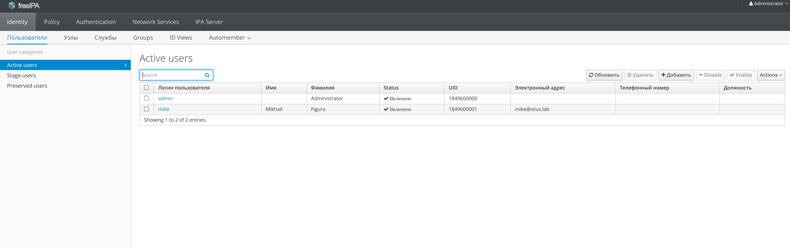
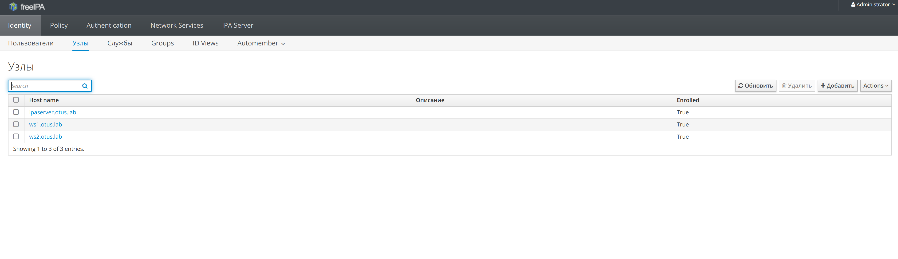
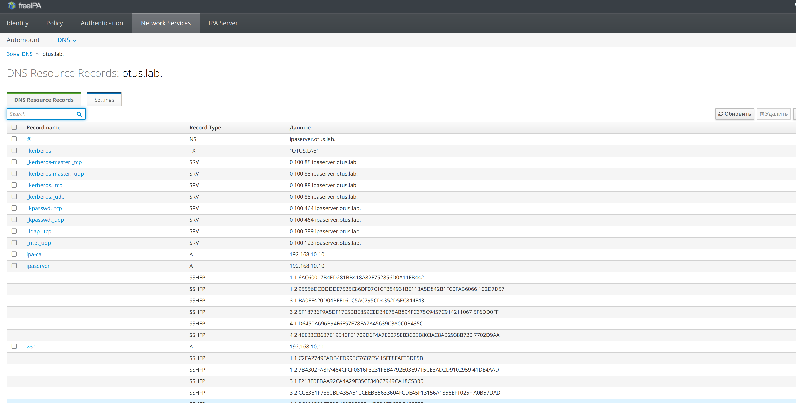

### Задание

1. Установить FreeIPA;
2. Написать Ansible playbook для конфигурации клиента;
3. \* Настроить аутентификацию по SSH-ключам;
4. ** Firewall должен быть включен на сервере и на клиенте.

### собственно выполнение задания

Созданы две ansible-роли, которые конфигурируют хост `ipaserver` в качестве FreeIPA сервера и вводят в домен `otus.lab`.Также созданы две рабочие станции- хосты `ws1` и `ws2`. Кроме того  создается юзер `mike`, который может логиниться на хосты в домене с помощью публичного ключа ssh. Firewall при этом  остается включен и на сервере, и на клиенте.
Достаточно выполнить `vagrant up`. и зайти в web-gui по адресу `http://192.168.10.10/ `, логин для входа - `admin`, пароль - `passQwe1!`

***проверим работу стенда:***







***Проверка аутентификации по SSH-ключу:***

```
[vagrant@ws1 ~]$ ssh -i ./otus_lab_ssh_key mike@ws2.otus.lab
Creating home directory for mike.
[mike@ws2 ~]$ pwd
/home/mike
[vagrant@ws1 ~]$ ssh -i ./otus_lab_ssh_key mike@ipaserver.otus.lab
Creating home directory for mike.
[mike@ipaserver ~]$ pwd
/home/mike
[mike@ipaserver ~]$ logout
Connection to ipaserver.otus.lab closed.

```
